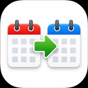

# Calendar Mirror

This is a simple macOS menu bar app that syncs two Calendar.app calendars.  It’s designed to mirror an Exchange calendar (like your work schedule) to a Google calendar (like your personal calendar) so you can see your availability across both accounts.  The sync is one way, so changes in the destination calendar do not appear in the source.  The destination calendar should be read-only to avoid confusion.

# CalendarMirror — Setup Instructions

## Prerequisites

Make sure Calendar.app has both accounts set up before launching CalendarMirror:
- Your **Exchange account** (with the calendar you want to mirror)
- Your **Google account** (with a destination calendar — create a dedicated one like "Availability" to keep things clean)

## Install

1. Unzip `CalendarMirror.app` and drag it to `/Applications` (or anywhere convenient).
2. On first launch, macOS will block it. Go to **System Settings → Privacy & Security** and click **Open Anyway**, then confirm.

## First Launch

1. macOS will ask for Calendar access — click **Allow Full Access**.
2. The **Preferences window** will open automatically.
3. Under **Source Calendars**, check the Exchange calendar(s) you want to mirror.
4. Under **Destination Calendar**, select your Google calendar.
5. Check **Launch at Login** so the app starts automatically after a reboot.
6. Close Preferences — sync starts immediately.

## Normal Use

CalendarMirror runs as a menu bar icon (calendar symbol). It syncs every 10 minutes automatically. You can also click the icon and choose **Sync Now**. To configure calendars later, choose **Preferences…** from the menu.

## Development & Distribution

The Xcode project is at `CalendarSyncApp/CalendarMirror.xcodeproj`. Main source files are `AppDelegate.swift` and `PreferencesView.swift` under `CalendarMirror/`.

### Building a release

1. In Xcode, choose **Product → Archive**.
2. In the Organizer, right-click the archive → **Show in Finder**.
3. Right-click the `.xcarchive` → **Show Package Contents**.
4. Navigate to `Products/Applications/` and copy out `CalendarMirror.app`.
5. Zip it (right-click → Compress) and send it to the recipient.

No Developer ID certificate is available, so the app cannot be notarized. Recipients will need to bypass Gatekeeper on first launch (System Settings → Privacy & Security → Open Anyway).

---

## Troubleshooting

If events aren't appearing, check **View Log** in the menu for error messages. Common issues:
- Calendar access not granted — check System Settings → Privacy & Security → Calendars
- Exchange or Google account not showing in Calendar.app — add it in Calendar.app → Settings → Accounts first
